

1. The Coconut 2D Project idea
==============================

Coconut2D is a software project for creating HTML5, iOS, Android and PC games that your really design and code once, and play everywhere!

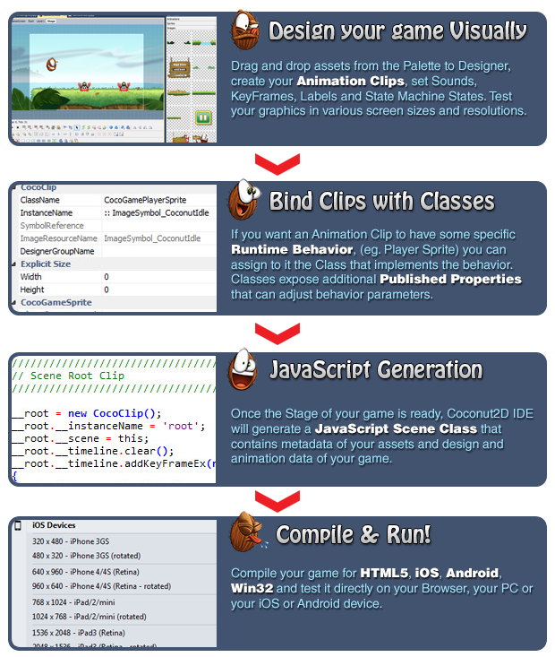

This GitHub Repository contains the Open Source **Coconut2D SDK**, which is the Toolchain and Core Frameworks of Coconut2D project. Please note that this repository does not contain Coconut2D Studio IDE which is a commercial product (or at least will be when we manage to finish it :)

2. Coconut2D SDK Architecture
==============================

Coconut2D virtualizes the **HTML5 Canvas** and uses **Object Oriented JavaScript** as the single code-base language. Developers can write and debug their games in Object Oriented JavaScript against the virtual HTML5 Canvas using Coconut2D Studio IDE.

Once a games is ready for release, it can be compiled to **HTML5 and ECMA JavaScript** code, as well as **Native C++11** code for iOS, Android and x86 apps. We developed a state of the art open source compiler, that generates cross-browser ECMA JavaScript and portable C++11 code from Object Oriented JavaScript source code.

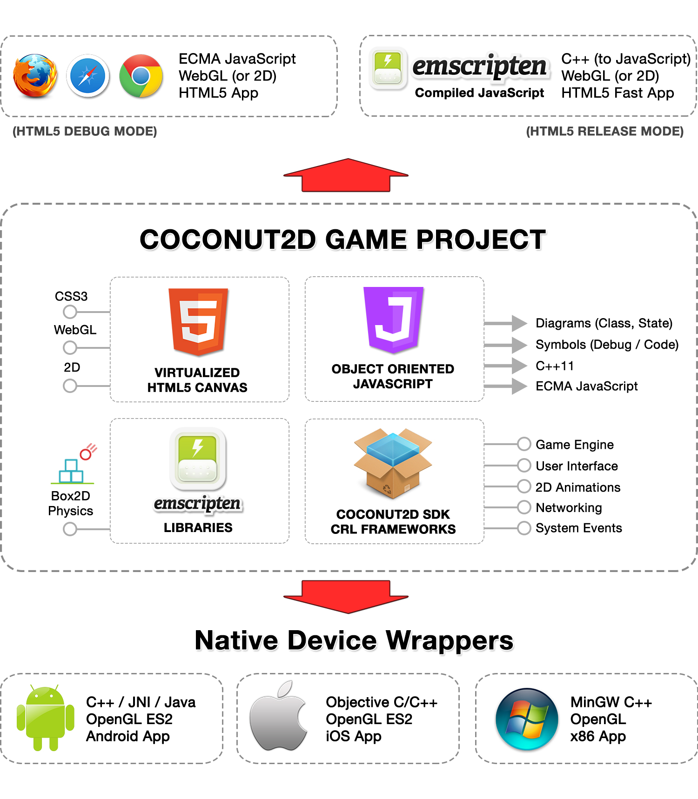

2.1. Coconut2D Frameworks
-------------------------

We encapsulated all **Core Frameworks**, such as **Animations**, **2D Game Engine**, **User Interface**, **Networking**, etc. inside a **Common Runtime Layer (CRL)** also written in Object Oriented JavaScript.

| Framework	               | Description                                                              |
|--------------------------|--------------------------------------------------------------------------|
|org.coconut2d.sdk.anim    | Core Animations Framework, implements `Game Engine`.                     |
|org.coconut2d.sdk.ui      | User Interface Framework, implements Controls, Buttons, Forms, etc.      |
|org.coconut2d.sdk.game2d  | 2D Games Framework, implements Sprite, TiledLayer, Parallax Layers, etc. |
|org.coconut2d.sdk.html5   | HTML5 Emulation Framework (Window, Document, Elements, Events)           |
|org.coconut2d.sdk.webgl   | HTML5 WebGL Emulation Framework, implements WebGL Context.               |
|org.coconut2d.sdk.net     | Networking Framework (XMLHttp, Facebook, Twitter, etc.)                  |
|org.coconut2d.sdk.server  | node.js Server Side Framework, implements basic HTTP Server.             |
|org.coconut2d.sdk.tests   | General Purpose Testing Framework.                                       |                                                                                                  |
|org.emscripten.box2d      | Emscripten derived Box2D Physics Framework (compiled from C++)           |

2.2. Coconut2D Layering
-----------------------

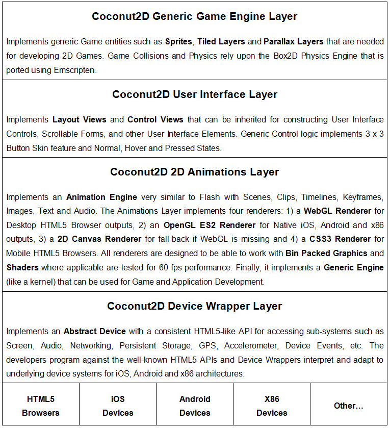

2.3. 2D Game Engine
-------------------

**Coconut2D Game Engine** is a **Finite State Machine Automaton** controlled by a new programming entity called **State**. States define a singularity in the execution context of Game Loop, they have explicit **enter** and **exit** points and they offer distinction between **tick** and **paint**.

To unify Native and HTML5 worlds under a single API while getting the best performance every time, we designed a set of **Native Device Wrappers** that virtualize the **HTML5 Canvas** across desktop, tablet, mobile and other devices.

3. Technologies
================

3.1. Renderering Engines
-------------------------

Coconut2D core rendering engine is OpenGL ES2 but we have implemented special renderers for WebGL, CanvasRenderingContext2D and CSS3 for supporting Mobile HTML5 Browsers.

3.2. Integrating with Emscripten
--------------------------------

Especially for HTML5, a game can also be compiled to C++ and post-compiled with **Emscripten** to JavaScript byte code. Compiled JavaScript can be up to x10 times faster than "regular" handwritten JavaScript and runs on all browsers.

Emscripten is a C++ to JavaScript compiler developed by Alon Zakai (Kripken). Coconut2D uses Emscripten both for binding 3rd party C++ libraries (such as Box2D Physics) with generated ECMA JavaScript code, and also for post-compiling and optimizing a game for HTML5 Browsers.

3.3. Compiling iOS Apps on Windows
----------------------------------

Coconut2D Studio IDE is capable of compiling C++11 code directly into a native iOS, Android and x86 applications. Especially for iOS apps, they are trully compiled on Windows, using a special port of the LLVM compiler developed by Pierre-Marie Baty; that is the same compiler Apple uses in XCode. iOS compilation process of Coconut2D Studio also code signs your apps with your official developer certificate.

3.4. Object Oriented JavaScript
-------------------------------

-----

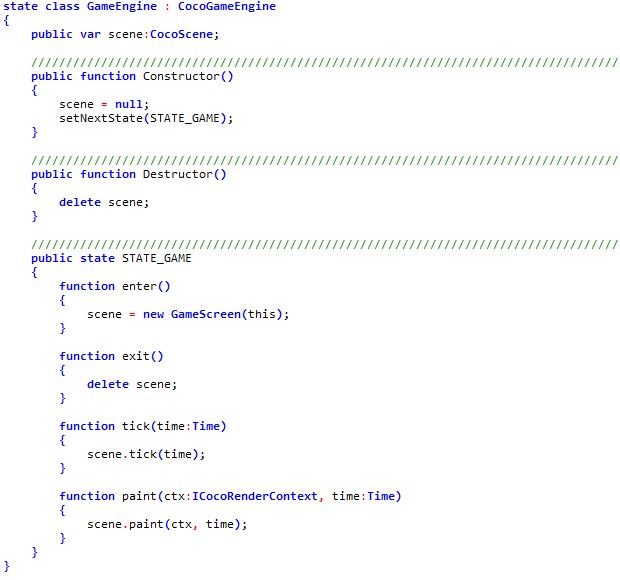

Language Features:

* Real Classes as first-class citizens
* Constructor with constructor arguments and inline base class initialization
* Destructor (invoked on delete)
* Public, Private, Protected Access Modifiers
* Published Access Modififer for Design-Time binding
* Abstract Functions
* Static Functions and Fields
* Virtual Functions and base class access with super keyword
* Function Overloads
* Constants and Enums
* Properties (setter, getter)
* Events Registration and Notification System
* Interfaces and implements keyword
* Structs (with super fast instantiation)
* States (for Game Loop FSM)
* Class and Interface Inheritance Model
* Class Delegation Model
* Strong Type System
* Explicit Integer, Float, Time, String, Boolean and Date datatypes
* Stream and DataStream datatype
* Typed Arrays and Arrays of Objects
* Conditional Compilation and Compiler Directives (eg. #ifdef BOX_2D )
* Export of Debug Symbol Tables for real Debugging
* Export of Code Symbols for IntelliSyntax Editing
* Export of State Machine and Class Diagrams
* Compiles to ECMA JavaScript cross-browser code
* Compiles to C++11 Portable Code

We also developed **CocoPlayer**, a Simulator powered by **Google V8 JavaScript VM Engine** where developers can test, debug and profile their games and apps. CocoPlayer is capable of simulating various screen resolutions taking into account the different dpi of numerous iOS and Android devices. The full-fledged Object Oriented JavaScript Debugger is one of Coconut2D Studio's unique features!

4. Work in Progress
====================
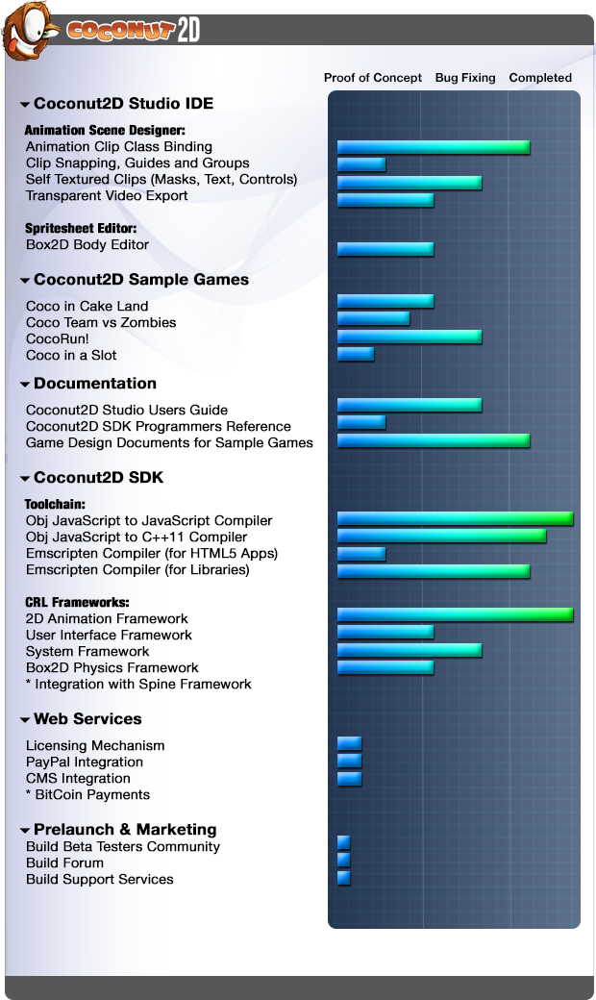

5. Sample Games
================

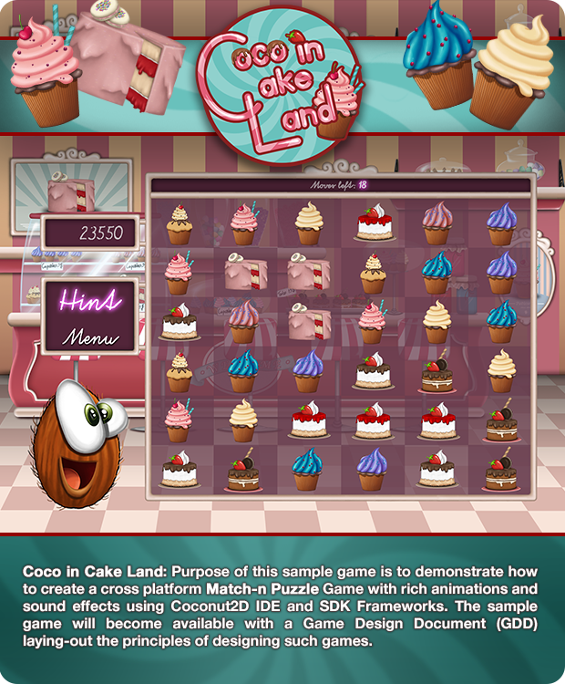

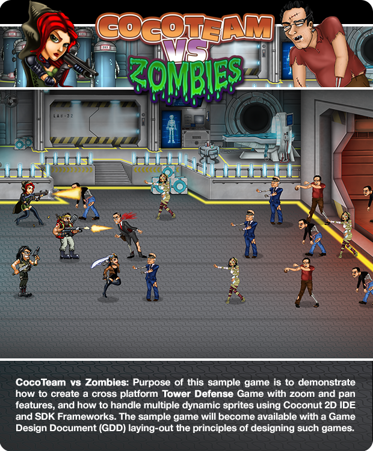

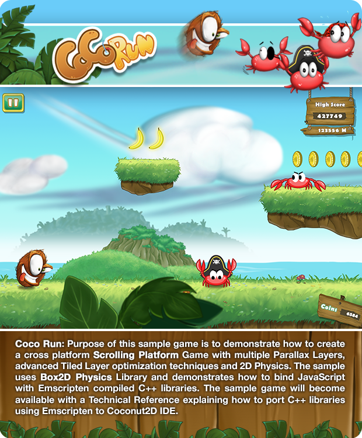

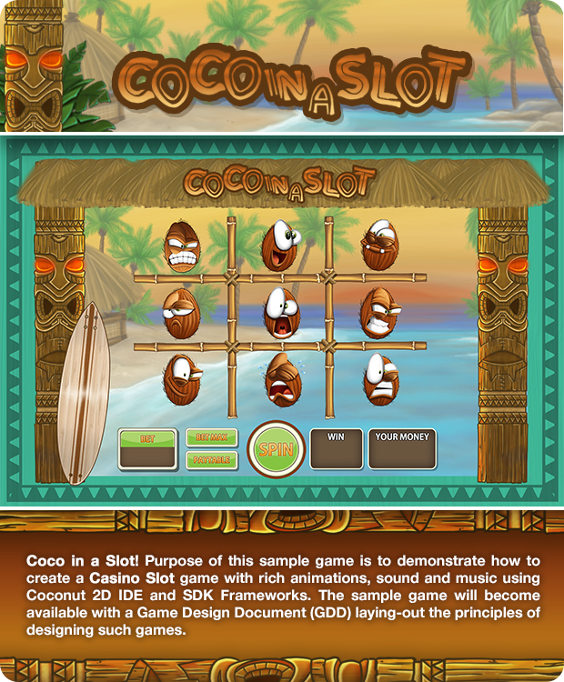

6. Credits
===========

6.1. Authors
------------

* Elias G. Politakis (epolitakis@mobilefx.com)
* George Mathioudakis (YiamiYo@mobilefx.com)

6.2. Coconut2D Team
-------------------

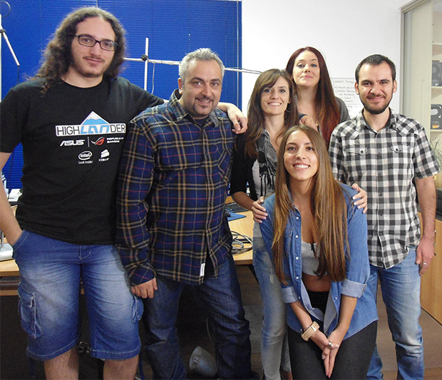

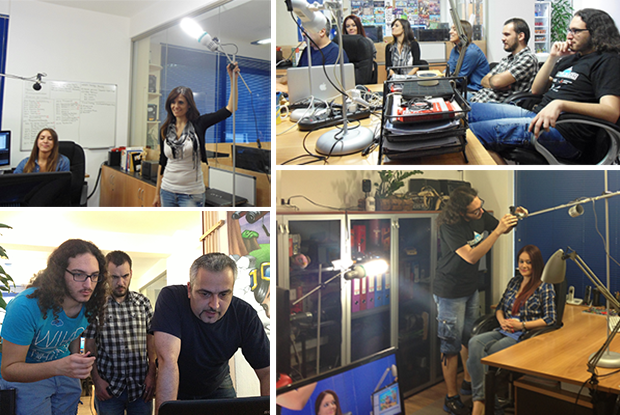

* Lina Kalostipi (Coconut2D Commercial Product Manager)
* Elias G. Politakis (Architect)
* George Mathioudakis (Lead Developer)
* Irida Kalostipi (Sample Games Programmer)
* Despina Leonti (Illustrator - Sample Games Designer)
* Sakis Garnelis (Animator - Concept Designer)

6.3. Coconut2D Video
--------------------

[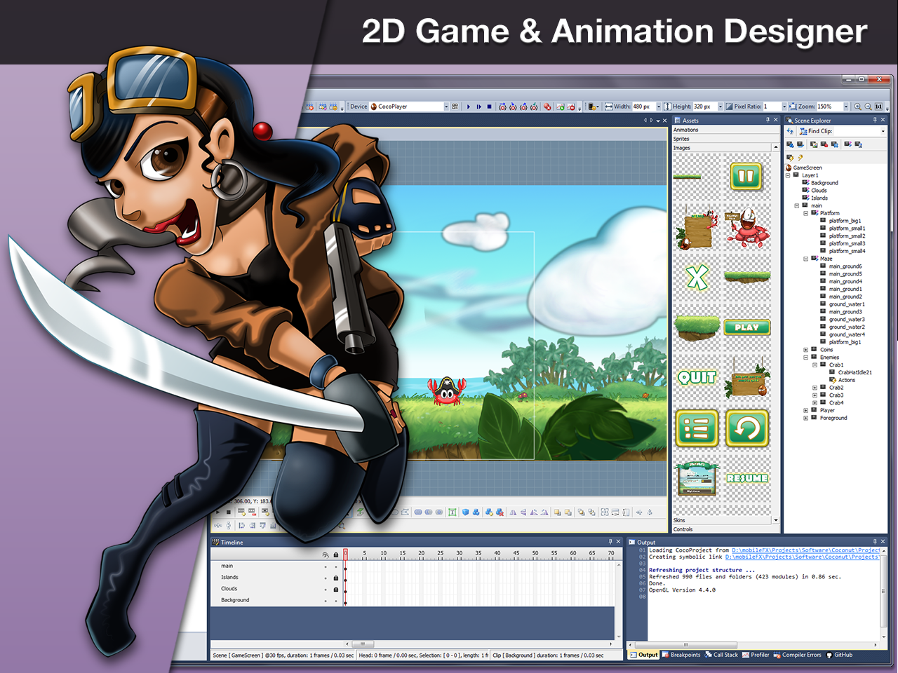](https://www.youtube.com/watch?v=6WGuwU_KDBQ&list=UUsdcgU-EYQA8b-dbjJdqTgA)

6.4. Coconut2D on Social Media
------------------------------

6.5. Contribute / Donate
------------------------

If this project is useful for you, you can help us sustain it either by contributing or by donating with Paypal.

